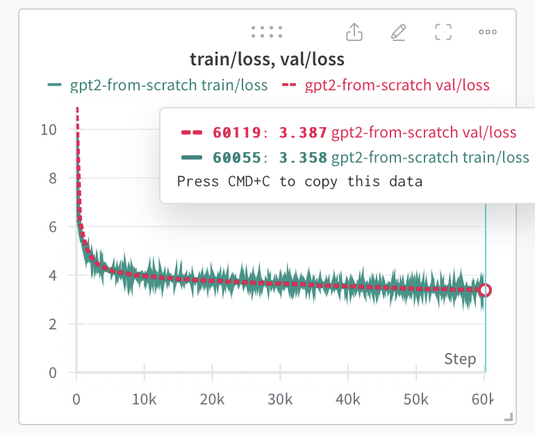
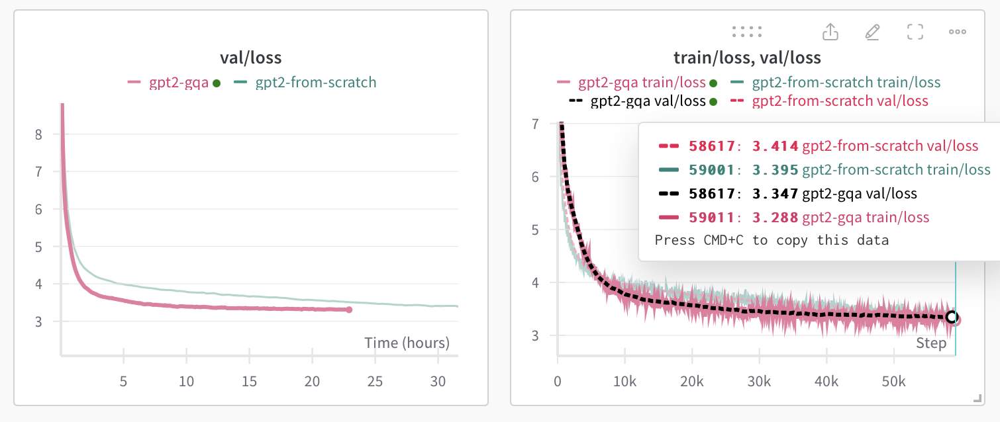

### Experiment results

- GPT:
  - Context: First training on Lightning.ai with T4 GPU. Small models, no expectation of good results just to test the code.
  - Dataset: The spanish bible. (bible_es.txt)
  - Params: 2 layers, 2 heads, 384 embedding size, 50304 vocab size (gpt2 tokenizer), 6e-5 learning rate, 256 block size, 64 batch size.
  - Results: Steps: 4600, training loss: 2.1826, validation loss: 3.1964
- GPT+RoPE:
  - Context: Same model but without the positional embedding. I implemented the RoPE (Relative Positional Encoding) instead.
  - Dataset: The spanish bible. (bible_es.txt)
  - Params: 2 layers, 2 heads, 384 embedding size, 50304 vocab size (gpt2 tokenizer), 6e-5 learning rate, 256 block size, 64 batch size. Total: 42.31M params.
  - Results: Steps: 4600, training loss: 2.1387, validation loss: 3.1603
  - Conclusions: The model with RoPE is slightly better than the model with positional embeddings. The model with RoPE has a lower training loss and validation loss.
- Added flash attention:
  - Context: No major improvement (around 1.23 seconds per step). This is because flash attention is more useful for long sequences (not the case here).
  - Todo: We can test the difference when increasing the model size (and context length).
- Openweb dataset:
  - Context: New dataset with much larger amount of tokens to minimize the disparity between training and val loss. Also, I started using lightning L4 GPU with 24gb of ram. With no changes on the hyperparams, the training usage is around 18.5gb.
  - Dataset: Openwebtext
  - Params: 2 layers, 2 heads, 384 embedding size, 50304 vocab size (gpt2 tokenizer), 6e-5 learning rate, 256 block size, 64 batch size. Total: 42.31M params.
  - Results: step 4600: train loss 5.3644, val loss 5.3708, time (s): 0.68788, full time: 3220.8362
  - Conclusions: The results are what I expected. 
    1. Minimal difference between train and validation loss which indicates that the larger dataset helps avoid overfitting.
    2. Larger dataset increase the number of steps to achive similar tran-val losses.
    3. Increasing the gpu helped with time per step from 1.23s recurrent to a decaying time per step from 0.75 to 0.68 (not sure why the time decays along the steps).
- Added microbatching:
  - Context: The model (gpt2-123M params) was too large for the gpu memory (24gb). I added microbatching to avoid this issue. Now batch size is 12 and gradient accumulation steps is 40.
  - Results: step 500: train loss 5.7003, val loss 5.7132, time (s): 23.80275, full time: 11990.43904. 
  - Conclusions: The model now is able to run in a single L4 gpu (24gb ram) only using 13gb. But the time per step is now 23s. This is because the model is now processing 40 steps before updating the weights. This is a tradeoff between memory and time. We have to lower the time per step and augment the usage of the gpu memory. Logging the info per step, I can see that the time per step decays from 138s to 67s in just 9 steps. This can be due to the fact that the model is learning and the gradients are getting smaller. Lets try to load the gpt-2 checkpoints and see if the model starts with a lower time per step.
- From pretrained gpt-2:
  - Context: In the previous iterations I saw that the time per step was too high but it was decaying along the steps. I wanted to test if the pretrained model starts with a lower time per step and the gradients update faster (as they are expected to get lower). Also remember that this model is 123M params with the same architecture as GPT-2 but using RoPE instead of the positional embeddings.
  - Results: step 500: train loss 3.6311, val loss 3.6341, time (s): 24.32832, full time: 12256.71348
  - Conclusions: The training started with a time per step similar to the raw model (108s in this case). Nevertheless, the time per step decayed much faster to 33s by step 9. By the step 30 the model was achieving a validation loss of 5.3. This is a good sign that the model is learning faster than the raw model. By step 500, the loss was 3.63, much lower than the training without the pretrained model. I observed that the time per step was around 24s and the loss was around 3.6, maybe implementing decaying learning rate we should achieve a better loss. Also, the model is using 13gb of the gpu memory, I should increase the gpu usage tu fill the 24gb of the L4 gpu.
- Dynamic learning rate pretrained gpt-2:
  - Context: Implemented a dynamic learning rate to decay the learning rate along the steps. The learning rate starts at 6e-4 and decays to a minimum of 6e-5.
  - Results: step 500: train loss 3.321, val loss 3.366, time (s): 24.8, full time: -
  - Conclusions: The implementation of the decaying lr has been successful since the model is learning faster and achieving a lower loss. The model trained until step 1281 (the gpu credits were over). The lowest training loss was 3.051. The model was using 15gb of the gpu memory. I should implement checkpoints to don't lose this training when I run out of gpu credits, more logging with wandb and change the hyperparams to use the full 24gb of the gpu.
- Improved training script:
  - Context: I implemented different things to improve the training. Now we compile the model. We use mixed precision with the proper gradient scaler. Also, I implemented the wandb logger to keep track of the training.
  - Results: The time per step has decreased to 8-10 seconds thanks to compilation and mixed precision. Now the model can compare to the Karpathy's initial setup. I achived 3.387 loss training from scratch the GPT-2 model with RoPE and dynamic learning rate. The model was using 26gb of gpu (A6000). 
  - Conclusions: The training was as expected, if we could train for more than 60k iterations (aprox the 600k of Karpathy's initial setup) we could achieve a lower loss (arround 2.85). The time per step was 1.8s.
  - Final setup: 60k iterations, 6e-4 to 6e-5 decaying lr, warmup 2k steps, 0.1 weight decay, 12 batch size and 5 gradient accumulation steps (to match the 0.5M tokens of the original setup we should accumulate 40 steps). 1.0 gradient clip. Also I used the 50304 vocab size instead of 50257 and 0.0 dropout.
  - Further considerations: Before the modifications of the training script, I was able to achieve better loss of 3.08 pretraining gpt-2 after 2 days of training. With the current script I achieved 3.38 with 31h of training but with a more stable training from scratch, not pretrained weights. After adding schedulers, mix precisions, weight decaying and much more training features, I wasn't able to train the model from pretrained weights, the model validation loss kept increasing after the first 500 steps (6 loss) and after 2k steps, the training loss kept increasing from 4 to 5. I could only train the model from scratch with float32. I should investigate why the model is not learning from pretrained weights (maybe some problem with the bf16 dtype). Some people posted on Kaprathy's repo that the training loss was exploding when using Karpathy's setup around step 20k.
  - Additional comments: I could keep training the model (maybe i will) until I achieve the 2.85 benchmark of a finetuned gpt-2 just to make sure that with less params, rotary positional embeddings and other changes could improve the base gpt-2 model. 
  
- GPT-2 Rope + GQA:
  - Context: Implemented GQA (Grouped Query Attention) to improve the model. The model was trained with 16 query heads and 4 key-value heads. 
  - Model params:113M
  - Results: The model trained much faster than the best result achieved before (take a look to the images comparing both runs). The model achieved better validation and training loss not only faster but also with less steps. The time per step was reduced from 1.8s to 0.8s and the model was using 14gb vs 26gb (the gpt-2 without gqa) of the gpu memory. With almost 24h of training the model achieved a validation loss of 3.305 vs 3.507. 
  - Conclusions: Significant improvement not only on the training time but also on the achieved loss with less trainable params (113M vs 123M).
  
  
-GPT-2 Rope + GQA + 8xH100:
  - I could train the model on a cluster of 8xH100 gpus. The model achieved a better Hellaswag evaluation result.
  - Context: Implemented the GPT-2 model with some major improvements: GeLU activation function, RoPE (Relative Positional Encoding), GQA, flash attention and learning rate decay while training. 14h of training (250k steps).
  - Dataset: Fineweb dataset (edu) 10B
  - Infra: AWS p5.48xlarge instance (8xH100 GPUs).
  - Model params: 113M
  - Results: Hellaswag evaluation accuracy of 32.03%. val loss: 2.978, train loss: 2.787
  - Conclusions: Improved the Andrej Karpathy's benchmark of 29.55% to 32.03% on hellaswag eval (repo) with less params.
